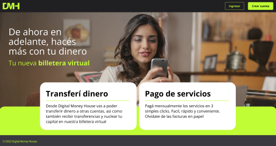
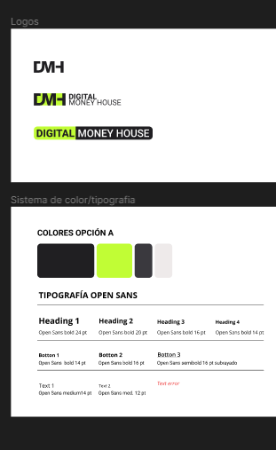

 
  

<h3 align="center"> Proyecto final del segundo track de Certified Tech Developer </h3>  

 

 
  

<!-- TABLE OF CONTENTS -->
<h2 id="table-of-contents"> :book: Tabla de contenidos</h2>

  
tabla de contenidos

  <ol>
    <li><a href="#about-the-project"> ➤ Acerca del proyecto </a></li>
    <li><a href="#prerequisites"> ➤ Tech Stack </a></li>
    <li><a href="#folder-structure"> ➤ Estructura de carpetas</a></li>
    <li><a href="#roadmap"> ➤ Roadmap</a></li>
    <li><a href="#references"> ➤ Referencias </a></li>
    <li><a href="#contributors"> ➤ Integrantes</a></li>
    <li><a href="#contributors"> ➤ Agradecimiento </a></li>
  </ol>

<!-- ABOUT THE PROJECT -->
<h2 id="about-the-project"> :pencil: Acerca del Proyecto</h2>

 
El proyecto consta del desarrollo de una aplicacion full stack con un backend preestablecido, infraestructura y desarrolo de frontend con Next.js. Se realizaran testeos a lo largo del desarrollo y el despliegue adoptando el metodo agil de TDD. 

El objetivo fundamental del proyecto es el aprendizaje y la puesta en práctica de las habilidades adquiridas durante toda la cursada.

          
  <!--figcaption>Caption goes here</figcaption-->

<!-- PREREQUISITES -->
<h2 id="prerequisites"> :fork_and_knife: Tech Stack</h2>

#### Front end
 - Git
 - Postman
 - Node.js
 - Visual Studio Code
 - Next.js 
 - React
 - Typescript
 - MongoDB
 - Vercel
 - Styled Components

#### Backend y Base De Datos
 - Git
 - Postman
 - Visual Studio
 - MySQL 
 - MongoDB Atlas
 - Docker
 - Minikube

#### Testing
 - Postman
 - Mocha
 - JUnit
 - Selenium
 - Jest

  https://docs.google.com/spreadsheets/d/1tb5XguhvcDcyyoWVv_L2QkMwJM2uPio-LPyVEgaJmnw/edit?usp=sharing

#### Infraestructura
 - AWS
 - Terraform
 - Docker
 - Ansible
 - Gitlab runner
 - Grafana
  
#### Gestion
 - Git + Gitlab
 - Zoom / Google meet

<!-- :paw_prints:-->
<!-- FOLDER STRUCTURE -->
<h2 id="folder-structure"> :cactus: Estructura de carpetas</h2>

    monorepo/
        digital-money-house/
            public
            src/

<!-- ROADMAP -->

<!-- REFERENCES -->
<h2 id="references"> 🌎 <a href= ''/>Proximamente pagina desplegada</h2>

<!-- CONTRIBUTORS -->
<h2 id="contributors"> :scroll: Integrantes</h2>

### Equipo de Desarrollo

  :boy: <b>Santiago Eraso</b>  
  &nbsp;&nbsp;&nbsp;&nbsp;&nbsp; Email: <a>dg.santiago.alvarez@gmail.com</a>  
  &nbsp;&nbsp;&nbsp;&nbsp;&nbsp; GitHub: <a href="">@</a>  

  :boy: <b>Gianluca D'Onofrio</b>  
  &nbsp;&nbsp;&nbsp;&nbsp;&nbsp; Email: <a>gian.donofrio2000@gmail.com</a>  
  &nbsp;&nbsp;&nbsp;&nbsp;&nbsp; GitHub: <a href="">@</a>  

  :boy: <b>Guido Michel Oudin</b>  
  &nbsp;&nbsp;&nbsp;&nbsp;&nbsp; Email: <a>guidooudin1@gmail.com</a>  
  &nbsp;&nbsp;&nbsp;&nbsp;&nbsp; GitHub: <a href="">@</a>  

  :woman: <b>Patricia Hunt</b>  
  &nbsp;&nbsp;&nbsp;&nbsp;&nbsp; Email: <a>huntpatito@gmail.com</a>  
  &nbsp;&nbsp;&nbsp;&nbsp;&nbsp; GitHub: <a href="">@</a>  
  
  :boy: <b>Felipe Verger</b>  
  &nbsp;&nbsp;&nbsp;&nbsp;&nbsp; Email: <a>felipeverger123@gmail.com</a>  
  &nbsp;&nbsp;&nbsp;&nbsp;&nbsp; GitHub: <a href="https://github.com/felipeVerger">@felipeVerger</a>  

  :woman: <b>Cecilia Daiana Gonzalez</b>  
  &nbsp;&nbsp;&nbsp;&nbsp;&nbsp; Email: <a>cecidg18@gmail.com</a>  
  &nbsp;&nbsp;&nbsp;&nbsp;&nbsp; GitHub: <a href="">@</a>  

  :woman: <b>Laura Fernández Río</b>  
  &nbsp;&nbsp;&nbsp;&nbsp;&nbsp; Email: <a>lauraabrilfr21@gmail.com</a>  
  &nbsp;&nbsp;&nbsp;&nbsp;&nbsp; GitHub: <a href="">@</a>  

### Product Owner:
:boy: <b></b>  
&nbsp;&nbsp;&nbsp;&nbsp;&nbsp; Email:   

### Scrum Master:
:woman: <b>Celeste Bogetti</b>  
&nbsp;&nbsp;&nbsp;&nbsp;&nbsp; Email: <a>celeste.bogetti@digitalhouse.com</a>  

 
✤ <i>Este es el proyecto final del segundo año de cursada de Certified Tech Developer, de <a href="https://www.digitalhouse.com/">Digital House</a><i>
